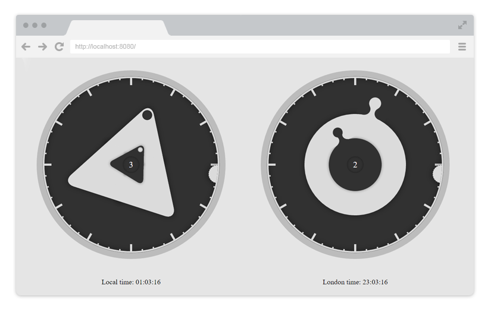

# React Fashion Watch v0.1.0

[](https://badge.fury.io/js/react-fashion-watch) [](http://badge.fury.io/bo/react-fashion-watch) [](https://david-dm.org/virtyaluk/react-fashion-watch) [](https://david-dm.org/virtyaluk/react-fashion-watch#info=devDependencies) [](https://david-dm.org/virtyaluk/react-fashion-watch#info=peerDependencies)

> A carefully crafted Fashion Watch component for React ([Demo](http://modern-dev.com/projects/fashion-watch/))

<p align="center">
  
</p>

## Installation

The package can be installed via:

- Bower: `bower install react-fashion-watch`
- NPM: `npm install react-fashion-watch --save`

You’ll need to install React separately since this dependency isn’t included in the package. Below is a simple example on how to use the FashionWatch in a React view. You will also need to require the css file from this package (or provide your own). The example below shows how to include the css from this package if your build system supports requiring css files (webpack is one that does).

```js
import React from 'react';
import { render } from 'react-dom';
import FashionWatch from 'react-fashion-watch';
import 'react-fashion-watch/dist/react-fashion-watch.css';

class MyApp extends React.Component {
    render() {
        return (
            <FashionWatch />
        );
    }
}

render(<MyApp />, document.getElementById('app'));
```

## Configuration

The default FashionWatch can be initialised by:

```js
<FashionWatch
    rounded={false}
    updateInterval={1000}
    onTick={time => time}/>
```

This included the FashionWatch with its default functionality. To use more functionality you can pass extra props to the FashionWatch to enable them:

- Switch between two different styles: `rounded={true}`
- Change update interval by passing a value in milliseconds: `updateInterval={1000}`
- Change watch time using transform function: `onTick={time => time}`

 For example, you may transform time to show current time in London using next function:

 ```js
 // Function takes one argument - Date object with the current time.
 myOnTick(dateTime) {
     let utc = dateTime.getTime() + dateTime.getTimezoneOffset() * 60000,
         utcOffset = 0; // Since London is GMT 0

     // Return value must be Date object.
     return new Date(utc + 3600000 * utcOffset);
 }
 ```

 And then simply pass the function as the `onTick` property:

 ```js
 <FashionWatch onTick={this.myOnTick} />
 ```

## Compatibility

We're always trying to stay compatible with the latest version of React. We can't support all older versions of React, since React is still < 1.0 and introducing breaking changes every release.

Latest compatible versions:

- React 0.14 or newer: All above ReactFashionWatch v0.1.0

## Local Development

The `master` branch contains the latest version of the FashionWatch component. To start your example app, you can run `npm dev-server`. This starts a `react-dev-server` on `http://localhost:8080`. The server will automatically compile your changes and execute linters.

## The examples

The examples are hosted within the `example` folder and are ran in the simple add that loads the FashionWatch. To extend the examples with a new example, you can simply duplicate one of the existing examples and change the unique properties of your example.

## License

MIT © [Bohdan Shtepan](https://github.com/virtyaluk)